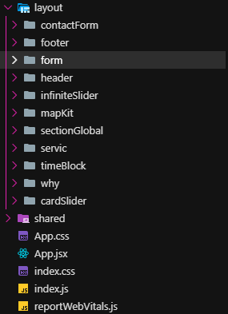
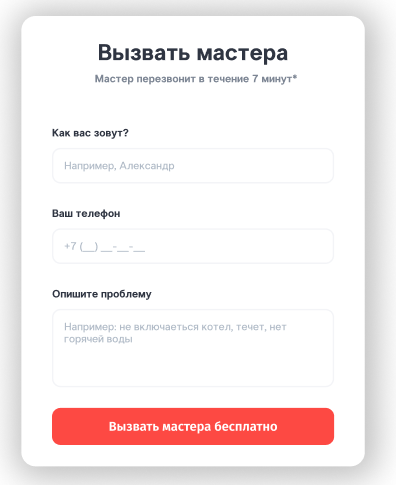
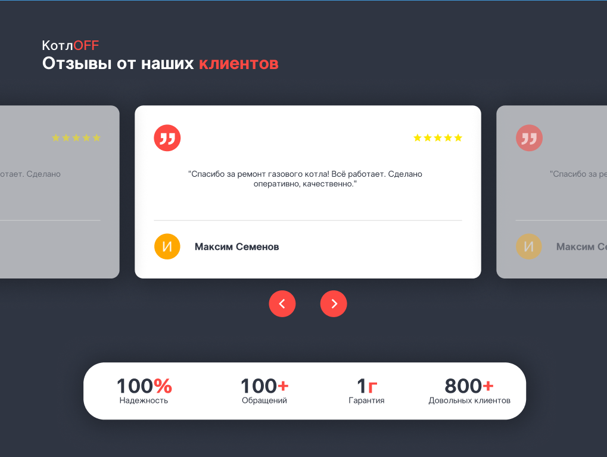
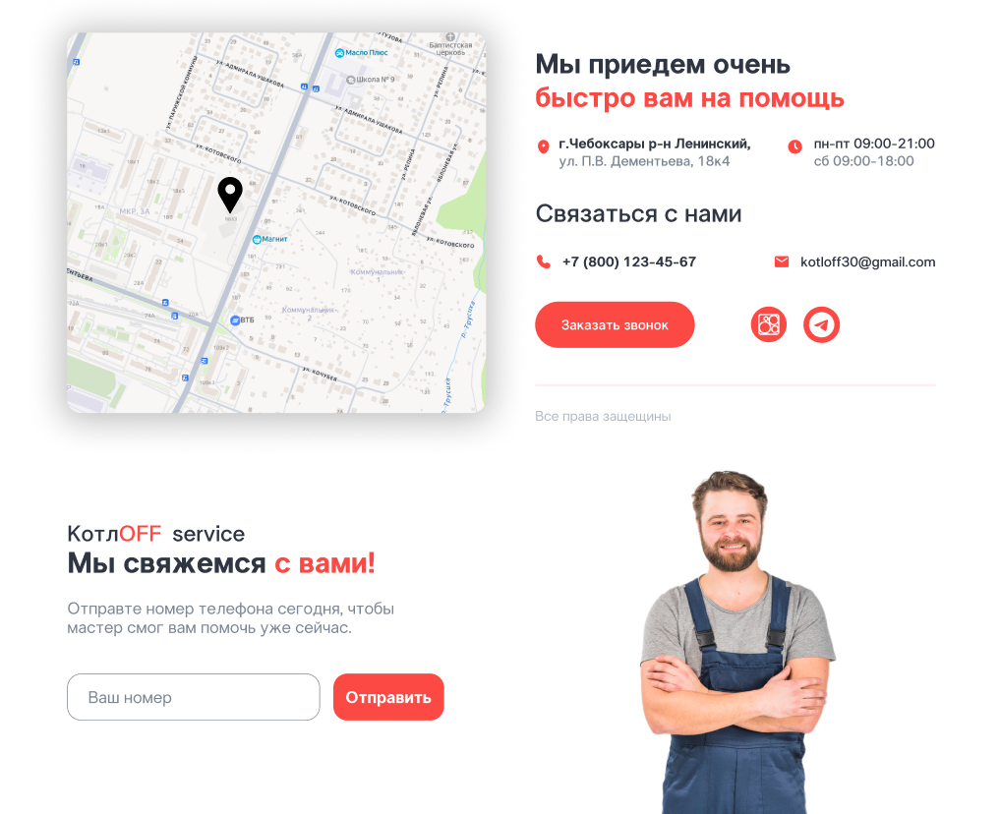

# Проект "КотлOFF Service"

## Fronted
* Core
    * React 18+ 
    * React Router v6
* Интеграция
    * Яндекс MapKit API
    * Jivo API (чат поддержки)
    * Telegram Widget API
* Деплой 
    * Netlify (CI/CD)

## Backend 
* Framework
    * Nest.js
* Базы данных
    * Firebase (Realtime Database / Firestore)
    * Google Sheets API (резервное хранение)
* Безопастность 
    * Argon2 для хеширования
    * Персональные данные (ФЗ-152)
    * JWT аутентификация
* Telegram Bot
    * Nest.js Telegraf/NestJS Telegram
    * Админ-панель в боте
    * Распределение заявок среди мастеров
* API
    * REST API
    * Webhooks

## Функционал
+ Распределение заявок между мастерами
+ Просмотр статуса выполнения
+ История обращений
* Уведомления о новых заявках
* Управление сотрудниками


## Telegram—Bot

## API
Мы использовали различные API такие как MapKit, Jivo, Google Sheet API, Telegram API С ними у нас получилось реализовать полноценный сайт для компании, и показать возможности взаимодействия пользовательского опыта с сайтом

### Примеры использования API
Сдесь очень простая логика, заходим на сайт, и требуем ссылку или ID для доступа
``` TypeScript
export class AppService {
  private readonly FIREBASE_URL = 'Ваш ID';
  private readonly GOOGLE_SHEETS_URL = 'Ваш ID';
  private readonly BOT_TOKEN = 'Ваш ID';

  async handleRequest(data: any): Promise<any> {
    const { name, phone, comment } = data;

    if (!name || !phone) {
      return { success: false, message: 'Заполните имя и телефон' };
    }

    try {
      console.log('=== НАЧАЛО ОБРАБОТКИ ===');
      
      const applicationId = `app_${Date.now()}`;
      console.log('ID заявки:', applicationId);
      
      const firebaseData = {
        id: applicationId,
        name: name.trim(),
        phone: phone.trim(),
        comment: comment || '',
        timestamp: new Date().toISOString(),
        source: 'website',
        status: 'new',
      };
      
      console.log('Данные для Firebase:', firebaseData);
      
      console.log('Сохранение в Firebase...');
      await this.saveToFirebase(firebaseData);
      console.log('Firebase сохранено');
      
      console.log('Отправка в Google Sheets...');
      await this.sendToGoogleSheets(name, phone, comment);
      console.log('Google Sheets отправлено');
      
      console.log('Отправка в Telegram...');
      await this.sendToTelegram(name, phone, comment, applicationId);
      console.log('Telegram отправлено');

      return {
        success: true,
        message: 'Заявка успешно отправлена',
        applicationId: applicationId,
      };
    } catch (error) {
      console.error('=== ОШИБКА ОБРАБОТКИ ===');
      console.error('Сообщение:', error.message);
      return {
        success: false,
        message: 'Ошибка при отправке заявки',
      };
    }
  }

  private async saveToFirebase(data: any): Promise<void> {
    const url = `${this.FIREBASE_URL}/applications/${data.id}.json`;
    console.log('Firebase URL:', url);
    
    const response = await axios.put(url, data);
    console.log('Firebase ответ:', response.status);
  }

  private async sendToGoogleSheets(name: string, phone: string, comment: string): Promise<void> {
    const params = new URLSearchParams();
    params.append('name', name);
    params.append('phone', phone);
    params.append('comment', comment || '');

    const response = await axios.post(
      this.GOOGLE_SHEETS_URL,
      params.toString(),
      {
        headers: {
          'Content-Type': 'application/x-www-form-urlencoded',
        },
      }
    );
    
    console.log('Google Sheets ответ:', response.data);
  }
```

## React
Использовался фрейм-ворк React на JS так как, современный стек дал больше профита и взаимодействия с frontend чем писать на чистом HTML and CSS. 
### React

Архитектура:



Также из интересного были реализованные блоки
- 1

 
- 2

 
- 3

 
- 4

 

## Хостинг

 ### 1. app.netlify.com
 ### 2.
